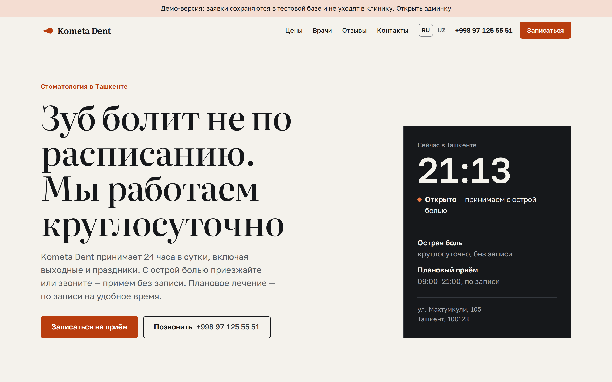
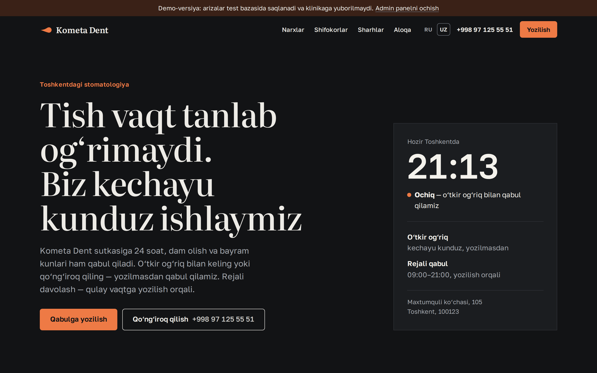
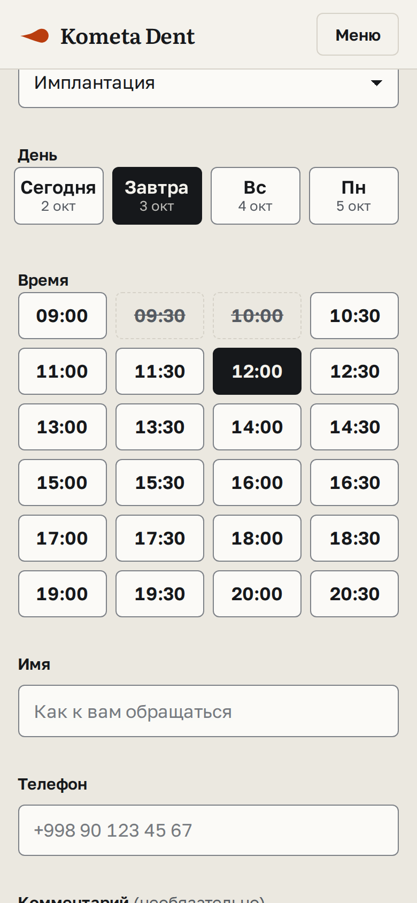
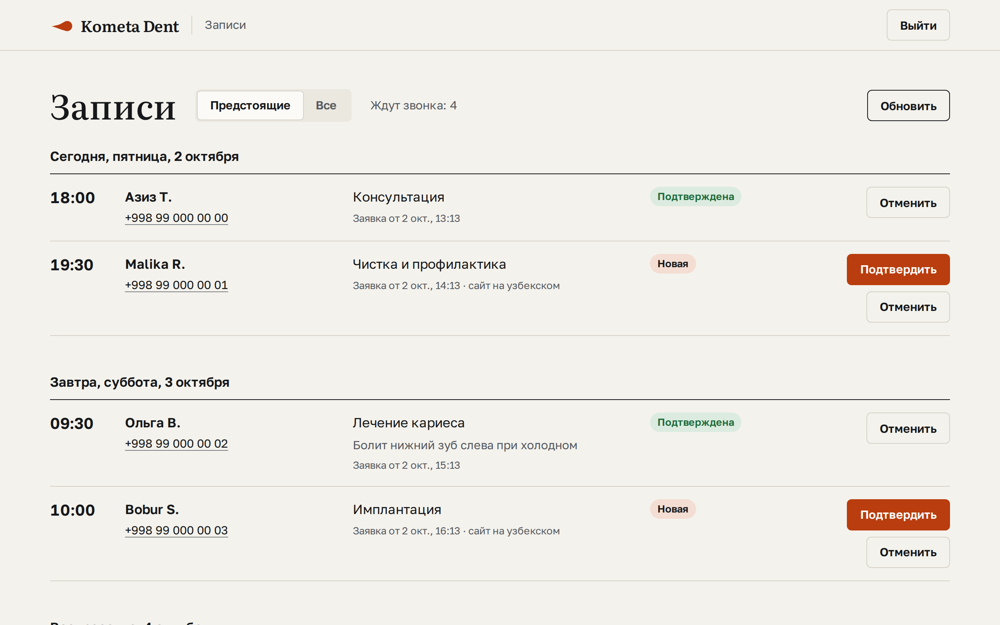
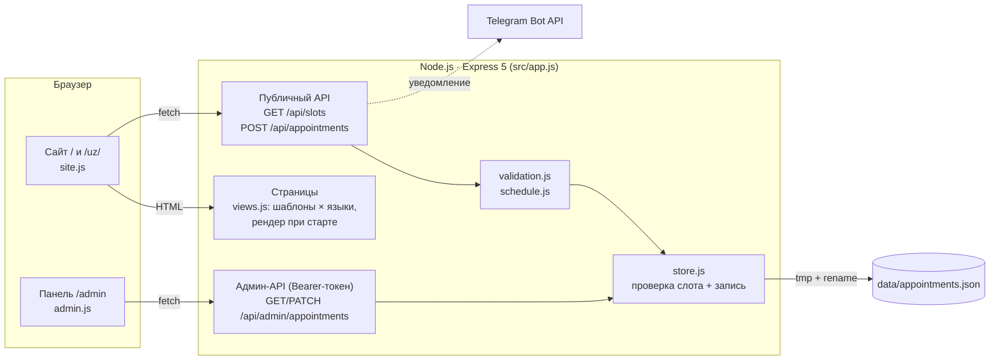
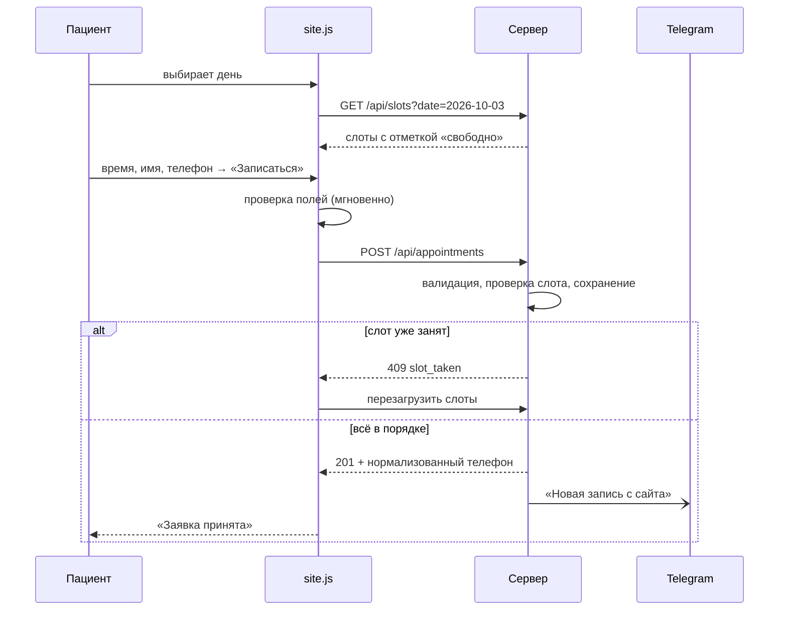

# Kometa Dent

Сайт круглосуточной стоматологии в Ташкенте: пациент выбирает свободное время и записывается за минуту, клиника получает заявку в Telegram и подтверждает её в своей панели.

[](https://github.com/Meewe123/kometa-dent/actions/workflows/ci.yml)



Попробовать за минуту без настройки и регистрации:

```bash
npm ci && npm run demo
# открыть http://localhost:3000, админка — http://localhost:3000/admin, токен demo
```

---

## Задача

У клиники одна особенность, ради которой к ней идут: она открыта круглосуточно. Поэтому у сайта два сценария, и оба видны с первого экрана:

1. **Болит сейчас.** Нужен телефон и уверенность, что ответят ночью. Кнопка «Позвонить» есть в первом экране и в нижней панели на телефоне. Рядом табло с текущим временем в Ташкенте и пометкой «Открыто».
2. **Плановое лечение.** Нужны цены, врачи и удобное время. Прайс-лист со стартовыми ценами, у каждой услуги ссылка «Записаться», которая сразу выбирает её в форме. Дни и свободные слоты на две недели вперёд.

Третий пользователь — администратор клиники. Ему нужно не пропустить заявку и быстро перезвонить: уведомление в Telegram и панель `/admin`, где записи разложены по дням.

## Возможности

**Для пациента**

- Запись: услуга → день → свободное время → имя и телефон. Занятые слоты зачёркнуты. Кнопка показывает выбранное время («Записаться на сб, 3 октября, 12:00»).
- Понятные ошибки у каждого поля; фокус переходит к первой ошибке; если слот только что заняли, расписание обновляется само.
- Русская версия по адресу `/`, узбекская — `/uz/`. Обе отрисованы на сервере, поэтому текст не мигает при загрузке, а поисковики видят обе версии.
- Светлая и тёмная тема по настройке системы; вёрстка от 360 px.
- Всё содержимое доступно и без JavaScript. Скрипт нужен только форме записи и мобильному меню; без него вместо формы показывается телефон.

**Для клиники**

- Уведомление в Telegram о каждой записи со ссылкой на панель.
- Панель `/admin` по токену: записи по дням, статусы «Новая / Подтверждена / Отменена», счётчик «Ждут звонка», автообновление раз в минуту.
- Отмена освобождает слот; вернуть отменённую запись нельзя, если время уже занял другой пациент.

**Демо-режим** (`npm run demo`) — данные в памяти, восемь вымышленных записей на ближайшие дни, токен админки `demo`, Telegram отключён, на сайте плашка «Демо-версия: заявки не уходят в клинику».

| Узбекская версия, тёмная тема                                        | Запись с телефона                                                       | Панель администратора                                 |
| -------------------------------------------------------------------- | ----------------------------------------------------------------------- | ----------------------------------------------------- |
|  |  |  |

## Стек

| Часть        | Что используется                                                  | Почему                                                                            |
| ------------ | ----------------------------------------------------------------- | --------------------------------------------------------------------------------- |
| Сервер       | Node.js 22, Express 5                                             | Небольшой API и отдача страниц, без лишних слоёв                                  |
| Страницы     | HTML-шаблоны с собственным мини-шаблонизатором (`src/views.js`)   | Две языковые версии рендерятся один раз при старте, отдать страницу — поиск в Map |
| Клиент       | Чистый JavaScript (ES-модули), без сборки                         | По одному файлу на страницу, ~5 КБ в gzip; фреймворк для формы и меню не нужен    |
| Стили        | CSS с дизайн-токенами, светлая и тёмная тема                      | Цвета, шрифты, отступы и анимации заданы в одном месте (`public/css/base.css`)    |
| Шрифты       | Literata (заголовки), Golos Text (текст), со своего сервера       | Хорошая кириллица и узбекская латиница; урезаны до нужных символов — 98 КБ на оба |
| Хранилище    | JSON-файл с атомарной записью                                     | Клинике хватит на годы; замена на SQL — один модуль (`src/store.js`)              |
| Безопасность | helmet (CSP), express-rate-limit                                  | Строгая политика без inline-скриптов, ограничение частоты запросов                |
| Качество     | node:test, Playwright, axe-core, ESLint, Prettier, GitHub Actions | Без лишних тестовых фреймворков: встроенный раннер Node                           |

## Архитектура



Как проходит запись:



### Решения и компромиссы

- **Двойная запись невозможна без блокировок.** Node выполняет JavaScript в одном потоке, а методы хранилища синхронные, поэтому между проверкой «слот свободен?» и записью не может вклиниться другой запрос. Гарантия действует для одного процесса; для нескольких экземпляров нужна база с уникальным индексом по (дата, время). Это записано в комментарии `src/store.js`.
- **Файл не повредится при сбое.** Запись идёт во временный файл, затем `rename` поверх основного: на одном диске это атомарная операция. Повреждённый файл не затирается молча: сервер не стартует и сообщает об ошибке.
- **Время клиники, а не сервера.** Все проверки «сегодня» и «уже прошло» считаются по `Asia/Tashkent` через `Intl`, поэтому сервер может стоять в любом часовом поясе. Это покрыто тестами с фиксированным временем.
- **Сервер — источник правды.** Браузер проверяет поля для быстрой подсказки, но сервер повторяет все проверки и отвечает кодами ошибок (`required`, `too_short`, `taken`…), а тексты на нужном языке подставляет клиент.
- **Опечатка в шаблоне ломает запуск, а не страницу.** Неизвестный ключ перевода или переменная бросают исключение при рендере, а тесты проверяют, что ключи совпадают в обоих языках и все используются.
- **Нет персональных данных в логах.** Логи — JSON-строки с id записи, услугой и временем, без имён и телефонов.
- **Кэш навсегда, обновление сразу.** К CSS и JS добавляется хеш содержимого (`site.css?v=3f2a…`), такие файлы кэшируются на год; после деплоя меняется хеш, и браузер берёт новую версию.

## Качество

| Проверка                              | Результат                                                                                                                                                                                   |
| ------------------------------------- | ------------------------------------------------------------------------------------------------------------------------------------------------------------------------------------------- |
| Юнит- и API-тесты (`npm test`)        | 61 тест: расписание и часовой пояс, валидация, хранилище (конфликты, атомарность, старый формат файла), экранирование для Telegram, все эндпоинты, рендер страниц, переводы                 |
| Браузерные тесты (`npm run test:e2e`) | 17 тестов в Chromium на десктопе и 360 px: запись целиком, ошибки формы, занятые слоты, смена языка, мобильное меню, вход в админку, отсутствие ошибок в консоли и горизонтальной прокрутки |
| Доступность                           | axe-core (WCAG 2.1 AA) на всех страницах — 0 нарушений; навигация с клавиатуры, видимый фокус, ошибки связаны с полями через `aria-describedby`                                             |
| Lighthouse, мобильный профиль         | Performance 99 · Accessibility 100 · Best Practices 100 · SEO 100                                                                                                                           |
| Lighthouse, десктоп                   | 100 · 100 · 100 · 100                                                                                                                                                                       |
| `npm audit --omit=dev`                | 0 уязвимостей                                                                                                                                                                               |

Всё, кроме Lighthouse, запускается в GitHub Actions на каждый push (Node 22 и 24).

## Безопасность

- Админ-API закрыт токеном (`ADMIN_TOKEN`, минимум 16 символов). Без токена админка выключена. Неудачные попытки ограничены: 20 за 15 минут.
- Content-Security-Policy без `unsafe-inline`: на страницах нет встроенных скриптов и стилей.
- Ввод проверяется по типу, длине и формату; телефон приводится к E.164; управляющие символы вырезаются.
- В уведомлениях Telegram пользовательский текст экранируется.
- Ограничение частоты: 10 заявок за 15 минут с одного IP; поле-ловушка для спам-ботов.
- Ошибки отдаются кодами без стектрейсов; тело запроса ограничено 10 КБ.
- Секреты только в переменных окружения, шаблон — `.env.example`. Docker-образ работает от непривилегированного пользователя.

## Запуск

Нужен Node.js 22.12 или новее.

```bash
npm ci
npm run demo            # демо: тестовые данные, токен админки demo
```

Рабочий режим:

```bash
cp .env.example .env    # заполнить ADMIN_TOKEN, при желании TELEGRAM_*
node --env-file=.env server.js
```

Через Docker:

```bash
docker build -t kometa-dent .
docker run -p 3000:3000 --env-file .env -v kometa-data:/app/data kometa-dent
```

### Переменные окружения

| Переменная                               | Назначение                                                                                                                               | По умолчанию                                                   |
| ---------------------------------------- | ---------------------------------------------------------------------------------------------------------------------------------------- | -------------------------------------------------------------- |
| `PORT`                                   | Порт сервера                                                                                                                             | `3000`                                                         |
| `SITE_URL`                               | Публичный адрес для Open Graph, sitemap и ссылки в Telegram. Если начинается с `https://`, включаются HSTS и `upgrade-insecure-requests` | `RENDER_EXTERNAL_URL` на Render, иначе `http://localhost:PORT` |
| `ADMIN_TOKEN`                            | Токен для `/admin`, от 16 символов. Без него админка выключена                                                                           | —                                                              |
| `TELEGRAM_BOT_TOKEN`, `TELEGRAM_CHAT_ID` | Уведомления о новых записях                                                                                                              | —                                                              |
| `DATA_DIR`                               | Папка с `appointments.json`                                                                                                              | `./data`                                                       |
| `DEMO_MODE`                              | Демо-режим (то же, что `--demo`)                                                                                                         | `false`                                                        |
| `TRUST_PROXY`                            | Сколько прокси перед приложением (для верного IP в rate limit)                                                                           | `0`                                                            |
| `LOG_LEVEL`                              | `debug`, `info`, `warn`, `error`, `silent`                                                                                               | `info`                                                         |

### Скрипты

| Команда                           | Что делает                                                                        |
| --------------------------------- | --------------------------------------------------------------------------------- |
| `npm start`                       | Запуск сервера                                                                    |
| `npm run dev`                     | Запуск с перезапуском при изменениях                                              |
| `npm run demo`                    | Демо-режим                                                                        |
| `npm test`                        | Юнит- и API-тесты                                                                 |
| `npm run test:e2e`                | Браузерные тесты и проверка доступности (нужен `npx playwright install chromium`) |
| `npm run lint` / `npm run format` | ESLint / Prettier                                                                 |
| `npm run check`                   | Линтер, формат и тесты одной командой                                             |
| `npm run images`                  | Пересобрать превью для соцсетей, иконки и скриншоты                               |

## Структура проекта

```
server.js              точка входа: конфиг, хранилище, Telegram, запуск
src/
  app.js               Express: маршруты, безопасность, кэширование, ошибки
  views.js             шаблонизатор и рендер страниц на двух языках
  schedule.js          слоты, окно записи, время Ташкента
  validation.js        проверка и нормализация заявки
  store.js             хранилище записей (JSON, атомарная запись)
  telegram.js          уведомления и экранирование
  catalog.js           услуги и стартовые цены
  clinic.js            телефон, адрес, ссылки на карты
  demo.js              тестовые записи для демо-режима
  config.js, logger.js
  i18n/ru.js, uz.js    все тексты сайта
views/                 HTML-шаблоны: главная, 404, админка, общие части
public/
  css/                 base.css (токены и компоненты), site.css, admin.css
  js/                  site.js (часы, меню, запись), admin.js
  fonts/               Literata и Golos Text (OFL)
  img/                 превью для соцсетей и иконки
test/                  node:test — юнит- и API-тесты
e2e/                   Playwright + axe
scripts/               сборка шрифтов и картинок
docs/                  скриншоты и исходное ТЗ на дизайн
```

## Как поменять контент

- **Тексты** — `src/i18n/ru.js` и `src/i18n/uz.js`. Ключи в обоих файлах должны совпадать, это проверяет тест.
- **Цены и список услуг** — `src/catalog.js`, названия и описания — в файлах переводов (`service.<id>`).
- **Телефон, адрес, соцсети** — `src/clinic.js`.
- **Часы плановой записи и окно в 14 дней** — константы в начале `src/schedule.js`.
- **Цвета и шрифты** — токены в начале `public/css/base.css`.

## Лицензия

Код — [MIT](LICENSE). Шрифты Literata и Golos Text — SIL Open Font License (`public/fonts/OFL-*.txt`). Название, тексты и данные о клинике принадлежат Kometa Dent.
